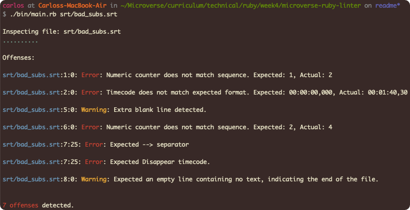
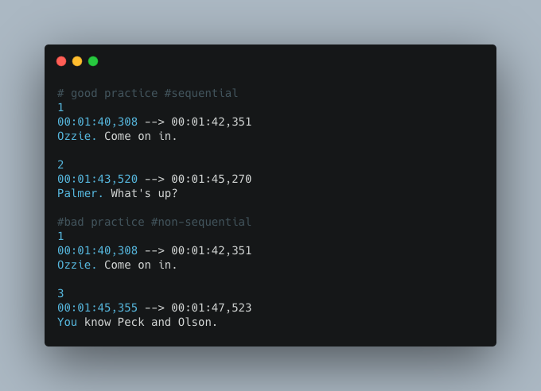
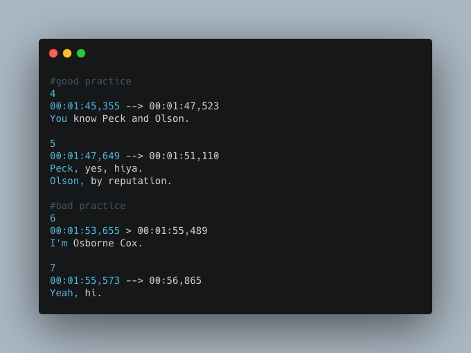
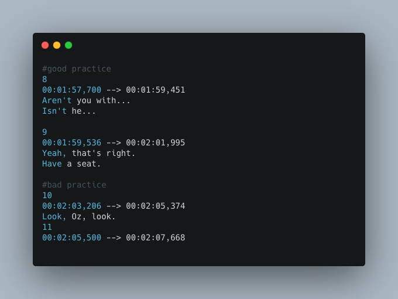

<br />
<p align="center">
  <a href="https://github.com/crgc/srt-linter">
    
  </a>

  <h3 align="center">SRT Linter</h3>

  <p align="center">
    This project is part of the Microverse Ruby Module
    <br />
    <a href="https://github.com/crgc/srt-linter/issues">Report Bug</a>
    ·
    <a href="https://github.com/crgc/srt-linter/issues">Request Feature</a>
  </p>
</p>

> A basic linter for SubRip (.srt) files

The SubRip Text file format (`.srt`) is a very popular video subtitle format that is widely used all over the web today. This linter checks that the SRT file conforms to the [SubRip](https://en.wikipedia.org/wiki/SubRip#File_format) format.

## How to run the SRT Linter

### Prerequisites

1. Ruby (~v2.6.3 or more recent) installed in your machine.

### Setup

* To clone this repository, open your Terminal and execute the following command:
```
git clone https://github.com/crgc/srt-linter.git
```

### Run
* Change into the folder
```
cd srt-linter
```
* Install gems
```
bundle install
```
* Locate the `.srt` file you wish to validate and run it against the SRT Linter
```
./bin/main.rb <path_to_srt_file>
```

## Good and Bad practices

### Numeric sequence for each subtitle
* Each subtitle should begin with a numeric counter identifying each sequential subtitle

    

### Subtitle timecode
* The second line of the subtitle is composed by the time that the subtitle should appear on the screen, followed by `-->` and then the time it should disappear

    

### Subtitle text & end of subtitle
* Then comes the subtitle text itself, on one or more lines (this linter imposes a hard limit at 2 lines). Finally, there must be a blank line containing no text, indicating the end of this subtitle

    

## Built With

- Ruby

## Authors

👤  **Carlos González**
- GitHub: [@crgc](https://github.com/crgc)
- Twitter: [@aclerkofpomier](https://twitter.com/aclerkofpomier)
- LinkedIn: [Carlos González](https://www.linkedin.com/in/carlosrmgonzalez/)

## 🤝 Contributing

Contributions, issues, and feature requests are welcome!

Feel free to check the [issues page](https://github.com/crgc/srt-linter/issues).

## Show your support

Give a ⭐️ if you like this project!

## 📝 License

This project is [MIT](https://www.mit.edu/~amini/LICENSE.md) licensed.
